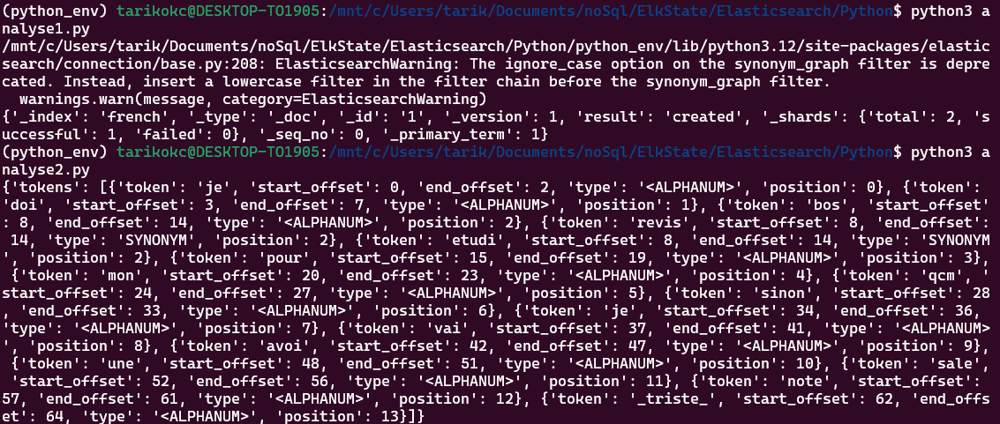

# Installation et Configuration d'Elasticsearch avec ICU

## Installation du Plugin ICU

1. Accéder au conteneur:
```bash
docker exec -it <container_name> bash
```

2. Installer le plugin ICU:
```bash
./bin/elasticsearch-plugin install analysis-icu
```

3. Redémarrer le conteneur:
```bash
docker restart <container_name>
```

4. Vérifier l'installation:
```bash
curl -X GET "http://localhost:9200/_cat/plugins?v"
```

## Configuration de l'Analyseur Français

5. Créer l'index avec l'analyseur:
```bash
curl -X PUT "http://localhost:9200/french" -H "Content-Type: application/json" -d '{
  "settings": {
    "analysis": {
      "filter": {
        "french_elision": {
          "type": "elision",
          "articles_case": true,
          "articles": ["l", "m", "t", "qu", "n", "s", "j", "d", "c", "jusqu", "quoiqu", "lorsqu", "puisqu"]
        },
        "french_synonym": {
          "type": "synonym",
          "ignore_case": true,
          "expand": true,
          "synonyms": [
            "réviser, étudier, bosser",
            "mayo, mayonnaise",
            "grille, toaste"
          ]
        },
        "french_stemmer": {
          "type": "stemmer",
          "language": "light_french"
        }
      },
      "analyzer": {
        "french_heavy": {
          "tokenizer": "icu_tokenizer",
          "filter": [
            "french_elision",
            "icu_folding",
            "french_synonym",
            "french_stemmer"
          ]
        },
        "french_light": {
          "tokenizer": "icu_tokenizer",
          "filter": [
            "french_elision",
            "icu_folding"
          ]
        }
      }
    }
  }
}'
```

## Installation du Client Python

6. Installer elasticsearch-py:
```bash
pip install "elasticsearch<7.14"
```

7. Exectuer les deux analyser 
```bash
python3 analyse1.py 
python3 analyse2.py
```

