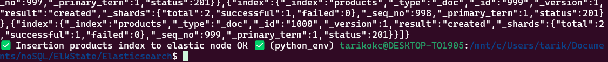

# Indexing Data in Elasticsearch

## Setup Bulk Indexing

### 1. Create Insert Script
Create a new file named `insert_data.sh` with the following content:

```bash
#!/bin/bash

curl -s -H "Content-Type: application/x-ndjson" -XPOST localhost:9200/receipe/_bulk --data-binary "@receipe.json" &&\
printf "\n✅ Insertion receipe index to elastic node OK ✅ "

curl -s -H "Content-Type: application/x-ndjson" -XPOST localhost:9200/accounts/docs/_bulk --data-binary "@accounts.json"
printf "\n✅ Insertion accounts index to elastic node OK ✅ "

curl -s -H "Content-Type: application/x-ndjson" -XPOST localhost:9200/movies/_bulk --data-binary "@movies.json"
printf "\n✅ Insertion movies index to elastic node OK ✅ "

curl -s -H "Content-Type: application/x-ndjson" -XPOST localhost:9200/products/_bulk --data-binary "@products.json"
printf "\n✅ Insertion products index to elastic node OK ✅ "
```

### 2. Make Script Executable
```bash
chmod +x insert_data.sh
```

### 3. Required JSON Files
- receipe.json
- accounts.json
- movies.json
- products.json

### 4. Run the Script
```bash
./insert_data.sh
```


### 5. Verify Indices
```bash
curl -X GET 'http://localhost:9200/_cat/indices?v'
```

