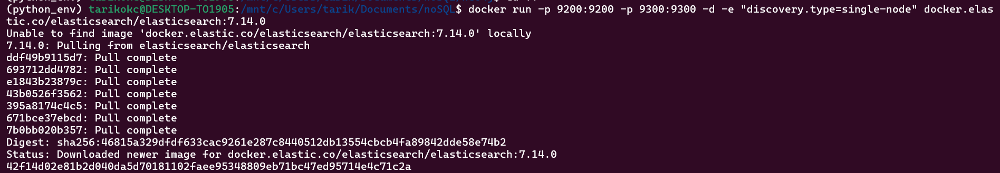
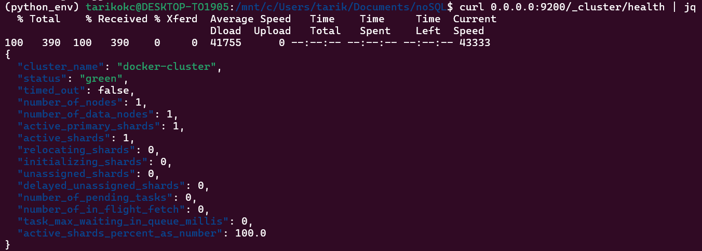
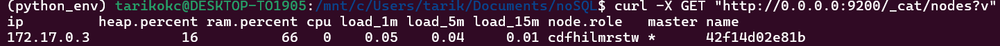

# Elasticsearch Setup Guide

## 1. Container Setup

### Launch Elasticsearch Container
```bash
docker run -p 9200:9200 -p 9300:9300 -d \
    -e "discovery.type=single-node" \
    docker.elastic.co/elasticsearch/elasticsearch:7.14.0
```



## 2. Verification Steps

### Check Cluster Health
```bash
curl 0.0.0.0:9200/_cluster/health | jq
```



### List Cluster Nodes
```bash
curl -X GET "http://0.0.0.0:9200/_cat/nodes?v"
```

