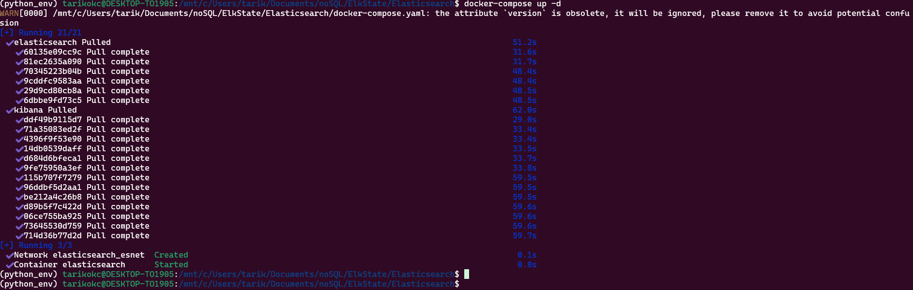
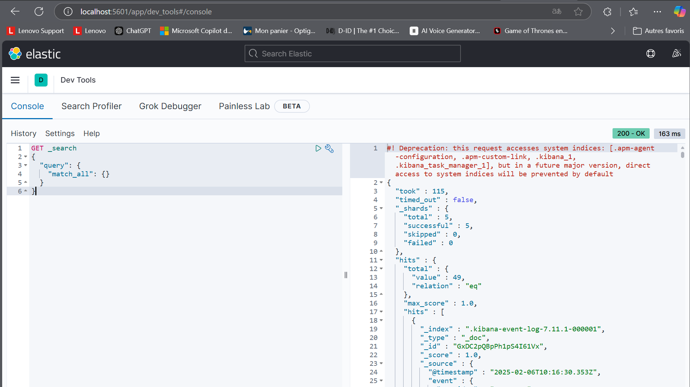
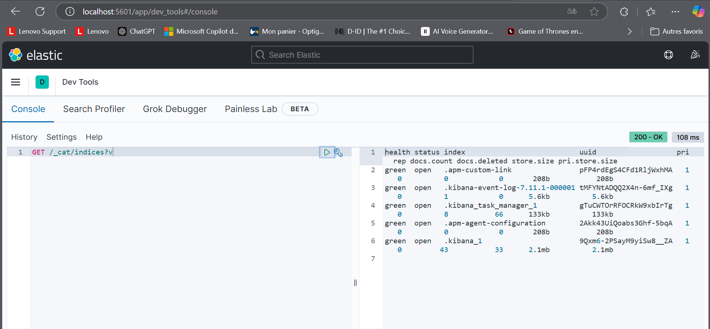
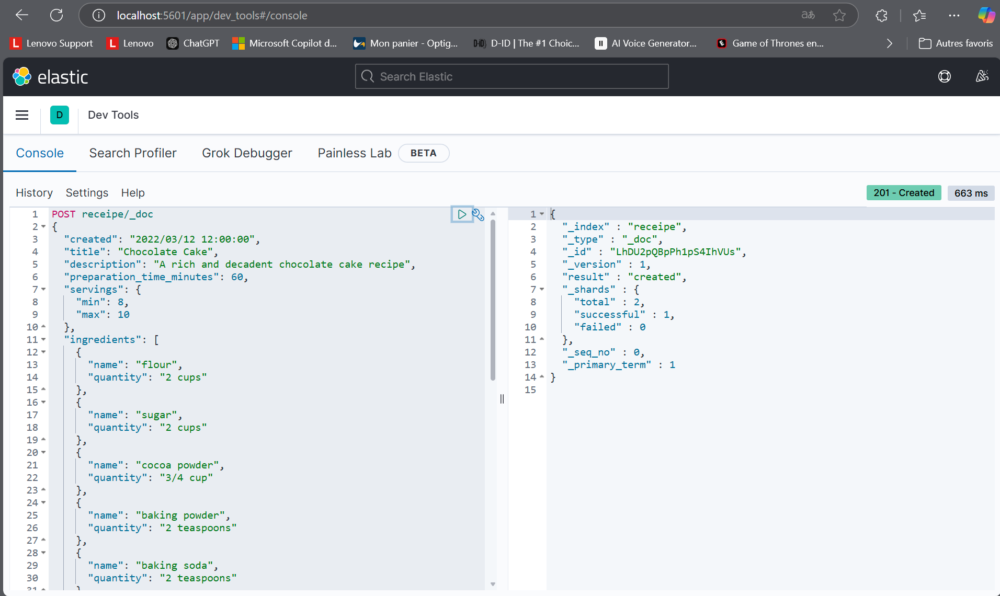
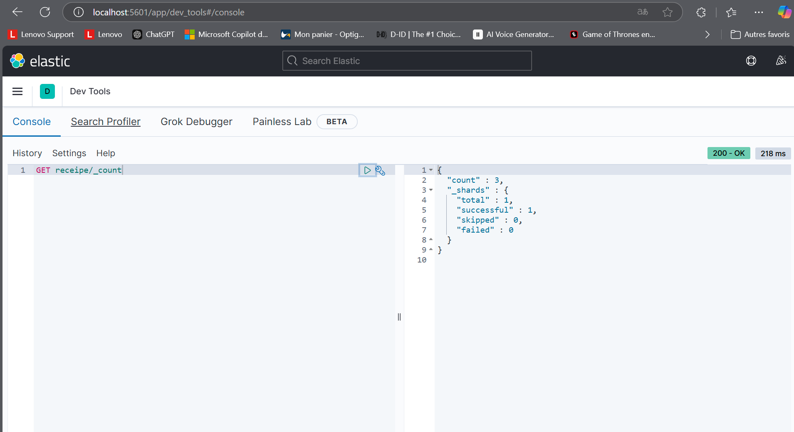
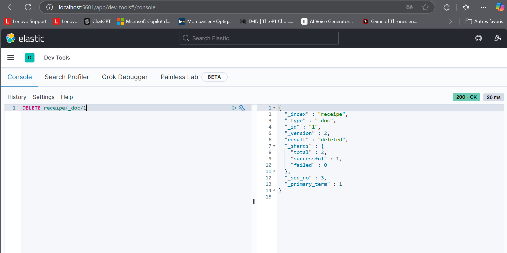

# Docker Compose Setup Guide

## Prerequisites

### 1. Install Docker Desktop
```bash
sudo apt-get update

sudo apt-get install docker.io

sudo apt install docker-compose
```

### docker-compose.yml
```yaml
version: '2.2'
services:
  elasticsearch:
    image: docker.elastic.co/elasticsearch/elasticsearch:7.11.1
    container_name: elasticsearch
    restart: always
    environment:
      - xpack.security.enabled=false
      - discovery.type=single-node
    ulimits:
      memlock:
        soft: -1
        hard: -1
      nofile:
        soft: 65536
        hard: 65536
    cap_add:
      - IPC_LOCK
    volumes:
      - ./elas1:/usr/share/elasticsearch/data
    ports:
      - 9200:9200
      - 9300:9300
    networks:
      - esnet

  kibana:
    container_name: kibana
    image: docker.elastic.co/kibana/kibana:7.11.1
    restart: always
    ports:
      - 5601:5601
    depends_on:
      - elasticsearch
    networks:
      - esnet

networks:
  esnet:
    driver: bridge
```
### Launch compose container
```bash
docker-compose up -d
```

## Testing the Setup
```bash

# Access Kibana
http://localhost:5601
```

### Query




#### Create document 


#### Get Count 


#### Delete 
