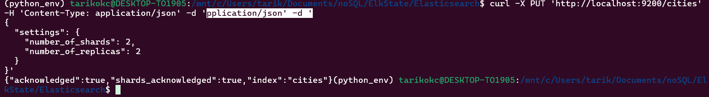
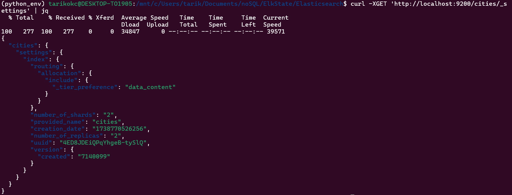
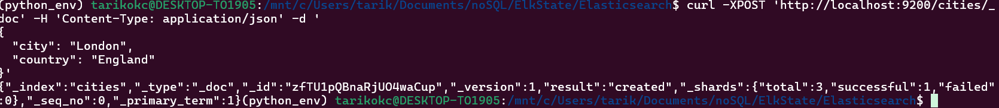

# Data Modeling in Elasticsearch

## 1. Delete Existing Index (if needed)
```bash
curl -X DELETE 'http://localhost:9200/cities'
```

## 2. Create Index with Settings
```bash
curl -X PUT 'http://localhost:9200/cities' -H 'Content-Type: application/json' -d '
{
  "settings": {
    "number_of_shards": 2,
    "number_of_replicas": 2
  }
}'
```



## 3. View Index Settings
```bash
curl -X GET 'http://localhost:9200/cities/_settings' | jq
```



## 4. Insert Document
```bash
curl -X POST 'http://localhost:9200/cities/_doc' -H 'Content-Type: application/json' -d '
{
  "city": "London",
  "country": "England"
}'
```



## 5. Verify Document
```bash
curl -X GET 'http://localhost:9200/cities/_doc/zfTU1pQBnaRjUO4waCup'
```

